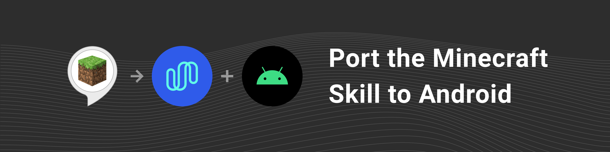

This repository is an Android port of Amazon's [Minecraft Helper NodeJS skill](https://github.com/alexa/skill-sample-nodejs-howto). It uses [Spokestack](https://spokestack.io) to replace Amazon's voice services.

The code is a companion to [this Spokestack tutorial](https://spokestack.io/blog/porting-the-alexa-minecraft-skill-to-android-using-spokestack). The tutorial includes instructions for creating your own NLU model files, but the models used for this demo are stored in this repository with [Git LFS](https://git-lfs.github.com/).

---
## Credits
Microphone icon made by [Kiranshastry](https://www.flaticon.com/authors/kiranshastry) at [www.flaticon.com](https://www.flaticon.com/).
